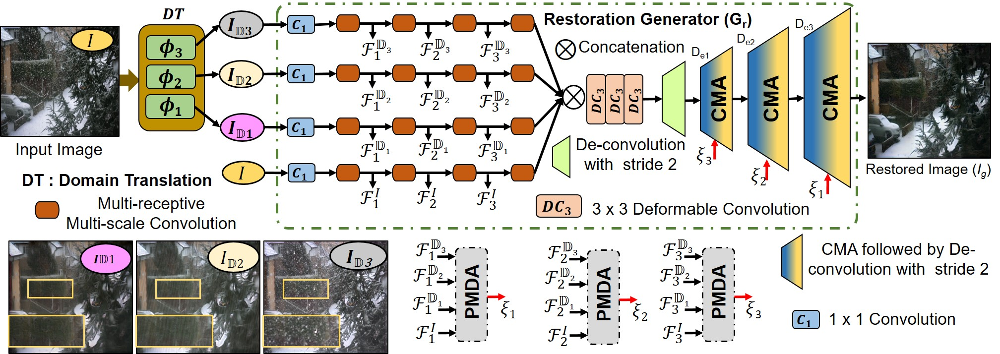

# Video Restoration Framework and its Meta-adaptations to Data-poor Conditions (ECCV2022)
Prashant W Patil, Sunil Gupta, Santu Rana, and Svetha Venkatesh


[](https://drive.google.com/file/d/1itwA0a1JQvS6sVsGDJ8Pt2DnQtG3UrJ8/view?usp=sharing)


<hr />

> **Abstract:** *Restoration of weather degraded videos is a challenging problem due to diverse weather conditions e.g., rain, haze, snow, etc. Existing works handle video restoration for each weather using a different custom-designed architecture. This approach has many limitations. First, a custom-designed architecture for each weather condition requires domain-specific knowledge. Second, disparate network architectures across weather conditions prevent easy knowledge transfer to novel weather conditions where we do not have a lot of data to train a model from scratch. For example, while there is a lot of common knowledge to exploit between the models of different weather conditions at day or night time, it is difficult to do such adaptation. To this end, we propose a generic architecture that is effective for any weather condition due to the ability to extract robust feature maps without any domain-specific knowledge. This is achieved by novel components: spatio-temporal feature modulation, multi-level feature aggregation, and recurrent guidance decoder. Next, we propose a meta-learning based adaptation of our deep architecture to the restoration of videos in data-poor conditions (night-time videos). We show comprehensive results on video de-hazing and de-raining datasets in addition to the meta-learning based adaptation results on night-time video restoration tasks. Our results clearly outperform the state-of-theart weather degraded video restoration methods.* 
<hr />

## Network Architecture

 

## Requirements:

	Python >= 3.5

	Tensorflow == 2.0

	Numpy

	PIL

## Testing Videos:
	Keep Testing Videos Frames in "videos/{dataset}" folder.

## Checkpoints:
	The checkpoints are provided for:
	1. Scratch trained checkpoints for REVIDE and RainSynAll100 datasets.
	2. Meta adapted checkpoints for "night time" Haze, Rain, and Rain+veling dataset.
	3. Keep the checkpoints in "./checkpoints/dataset/"
Download the checkpoint: [](https://drive.google.com/file/d/144BGWIvF2d-dZA6_8y9rBgbbO9CvxULH/view?usp=sharing)

## Testing Procedure:
	1. select options  --dataset, --test_dir, --checkpoint_path in "options.py"  
	2. Run "testing.py"
	3. Results will be saved in --output_path

## Database:


Synthetically Generated Night-time Weather Degraded Database is available at: [](https://drive.google.com/drive/folders/1zsW1D8Wtj_0GH1OOHSL7dwR_MIkZ8-zp?usp=sharing)

```

## Citation
If our method is useful for your research, please consider citing:
    
    @inproceedings{metarestoration2022,
	title={Video Restoration Framework and its Meta-adaptations to Data-poor Conditions},
	author={Prashant W Patil, Sunil Gupta, Santu Rana, and Svetha Venkatesh},
	booktitle={Proceedings of the European Conference on Computer Vision (ECCV)},
	pages={Accepted on 04/07/2022},
	year={2022}

}


## Contact
Please contact prashant.patil@deakin.edu.au, if you are facing any issue.


